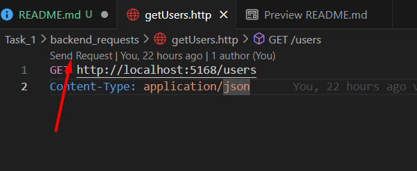

# Test Documentation

This test was fully developed using Visual Studio Code. I used the dotnet cli and Angular CLI for building both projects for task 1 and task 2.

## General Requirements

- You need to have VSCode installed
- You need to have .NET 8 SDK installed
- You need to have Angular 16 CLI installed
- You need to install Mongo Compass if you want to use the Mongo UI

## TASK 1

For this task, I created two folders inside the `Task_1` folder. These ones are the `Backend` and the `Frontend` folders. 

The `backend` folder contains a `WebApi` created with `.NET 8` and using `Clean Architecture` splitting conscerns in `API`, `Domain` and `Infrastructure`.

The `Frontend` folder contains an `Angular` app which is responsible for consuming the `API` endpoints.

### Requirements and how to execute apps

#### BACKEND

For running the backend locally you will need to install .NET 8 and then open the VSCode terminal by navigating to `Terminal > New Terminal` tab or by using the shortcut Shift + `. 

In the terminal navigate to the `backend` folder from the root folder by executing this command `cd .\Task_1\backend\`. Once in there run the following command to execute the API: `dotnet run`.

If you have problems with your connection string, it might be because you have a different one. In case you encounter any error related to the connection string, change the default one provided my mongo in the `appSettings.json` file from the `webapi` in the `backend` folder.

##### Testing the Backend endpoints

I created a list of HTTP files in the `Task_1\backend_requests` folder for testing without Swagger or Postman or Insomnia. For using this HTTP files in VSCode you will need to install the extension REST Client. You can do that by navigating to the VSCode Extensions tab or by using the shortcut `Ctrl + Shift + X` in Windows or `Cmd + Shift + X` in Mac I guess.

Once you followed the steps above, run the API and start using the HTTP files by clicking the `Send Request` button:

### FRONTEND

For running the frontend you need to install `Angular 16 CLI` by running this command `npm install -g @angular/cli@16`. This step asumes that you already have `node` installed on your machine. To verify installation run `ng version` in the terminal.

Once you installed the necessary packages for Angular, open a new VSCode terminal and from the root folder navigate to the `frontend` folder by running the following command `cd .\Task_1\frontend\`. Once in the right directory, run `npm i` to install all npm dependencies required from the project and once all dependencies are installed run `ng serve` to run the frontend of the app, which you can open in the url `http://localhost:4200`.

If using Chrome and there is an error saying `This website does not provide a secure connection` open the URL in an incognito tab.

## TASK 2

I created a `console` app and a `NUnit` app for this task. You can find all the files related to this task in the `Task_2` folder.

### Console App Execution

For executing the console app, open a new VSCode terminal and navigate from the root folder to the `BinaryStringAnalyzer` app using this command `cd . Task_2\src\BinaryStringAnalyzer\`. Once in there, execute `dotnet run` to execute the app.

### Tests Execution

For executing the tests, open a new VSCode terminal and navigate from the root folder to the `BinaryStringAnalyzer.Test` project using this command `cd .\Task_2\tests\BinaryStringAnalyzer.Tests\`. Once in there, execute `dotnet test` to execute the tests for the console app.